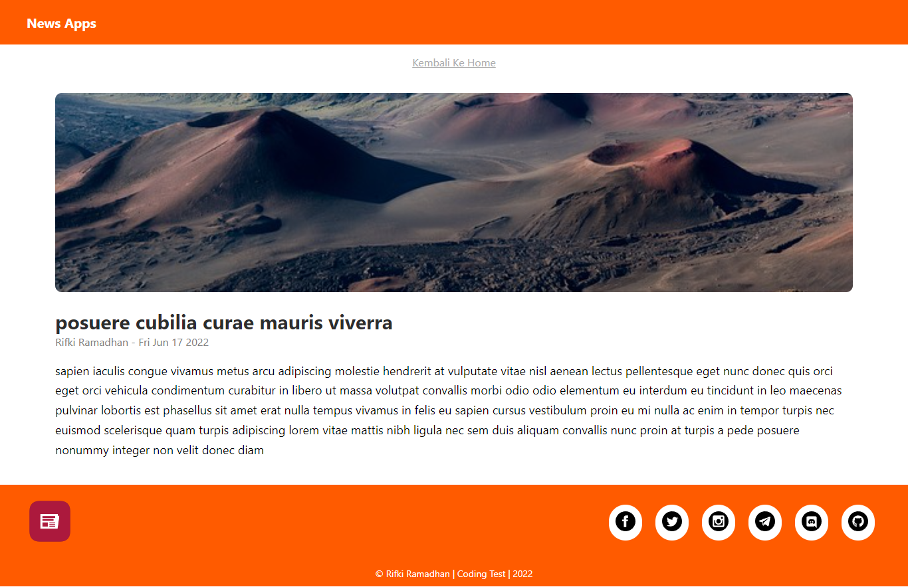
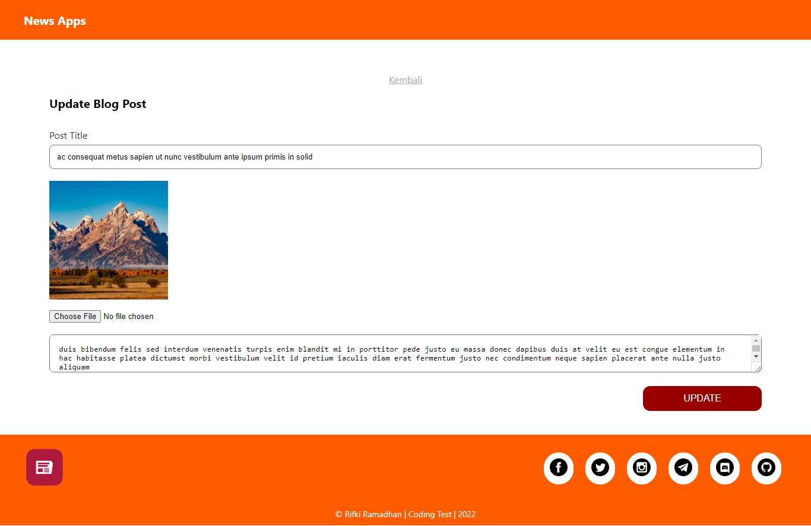

# Berikut Challenge Test inilah.com Frontend/Fullstack

## Task 1

### Buat sebuah algoritma/pemrograman (script) web atau aplikasi, pilih salah satu

- [x] Buat sebuah script untuk menampilkan 10 berita terkait berdasarkan artikel/berita yang sedang dibaca user

## Task 2

- [x] Bisa berupa gambaran besar nya, bisa lebih detail maka lebih baik

### Home Page

### Detail Page

### Update Blog

## Task 3

### Jelaskan anda menggunakan apa dalam membuat script tersebut dan apa kelebihan nya ?

- MERN Stack
  - Mongo DB
    - Adalah suatu open source yang bisa digunakan secara geratis yang berfungsi untuk database management system, kemudian Mongo DB ini bersifat document oriented database yang mana maksudnya adalah database yang kita simpan di dalam Mongo Db ini menggunakan colection dan document, Mongo DB juga disimpan dalam bentuk JSON Format
  - Express
    - Adalah suatu Framework yang digunakan untuk membangun suatu Aplikasi yang berbasiskan Node JS, dan Express ini bersifat server side jadi ini ada di belakang layar, atau di bagian Back End dengan menggunakan basic bahasa pemrograman nya adalah JavaScript, dan Express JS inilah yang berperan dalam mengatur server dan juga routing di dalam server kita
  - React
    - Adalah library JavaScript yang dibangun dengan bahasa pemrograman JavaScript
  - Node JS
    - Adalah JavaScript Runtime Environment, dimana sebelumnya JavaScript hanya berfungsi di sisi browser saja atau di sisi client, dengan adanya Node JS ini JavaScript sekarang bisa berada juga di dalam server side atau di sisi server

- Kelebihannya
  - Ketika kita membuat suatu Aplikasi dengan bahasa pemrograman JavaScript, maka kita dapat membuat suatu Aplikasi dari mulai Front End nya, hingga Back End nya, sampai ke database hanya menggunakan satu bahasa utama saja yaitu JavaScript

## API Documentation

- [API Documentation](https://documenter.getpostman.com/view/10749611/UzBjuUS3)

## Reference

- [Random Data](https://www.mockaroo.com)
- [Random Images](https://randomwordgenerator.com)
